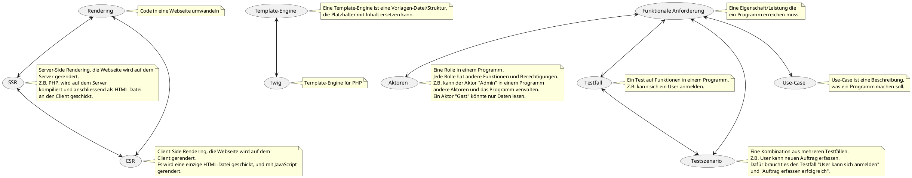

# LB2 Concept Map

```plantuml
@startuml

' ### Vorgegebene Begriffe ###
(SSR)
(CSR)
(Template-Engine) as (TE)
(Use-Case) as (UC)
(Aktoren)
(Funktionale Anforderung) as (FA)
(Testszenario) as (TS)
(Testfall) as (TF)

' ### Hilfsbegriffe ###
(Rendering)
(Twig)

' ### Map ###
(Rendering) <---> (SSR)
(Rendering) <---> (CSR)
(SSR) <---> (CSR)

(FA) <---> (TS)
(FA) <---> (TF)
(FA) <---> (UC)
(FA) <---> (Aktoren)
(TF) <---> (TS)

(TE) <---> (Twig)

' ### Notes ###
note right of (Rendering)
  Code in eine Webseite umwandeln
end note

note right of (SSR)
  Server-Side Rendering, die Webseite wird auf dem
  Server gerendert.
  Z.B. PHP, wird auf dem Server
  kompiliert und anschliessend als HTML-Datei
  an den Client geschickt.
end note

note right of (CSR)
  Client-Side Rendering, die Webseite wird auf dem
  Client gerendert.
  Es wird eine einzige HTML-Datei geschickt, und mit JavaScript
  gerendert.
end note

note right of (TE)
  Eine Template-Engine ist eine Vorlagen-Datei/Struktur,
  die Platzhalter mit Inhalt ersetzen kann.
end note

note right of (Twig)
  Template-Engine für PHP
end note

note right of (FA)
  Eine Eigenschaft/Leistung die
  ein Programm erreichen muss.
end note

note right of (Aktoren)
  Eine Rolle in einem Programm.
  Jede Rolle hat andere Funktionen und Berechtigungen.
  Z.B. kann der Aktor "Admin" in einem Programm
  andere Aktoren und das Programm verwalten.
  Ein Aktor "Gast" könnte nur Daten lesen.
end note

note right of (TF)
  Ein Test auf Funktionen in einem Programm.
  Z.B. kann sich ein User anmelden.
end note

note right of (TS)
  Eine Kombination aus mehreren Testfällen.
  Z.B. User kann neuen Auftrag erfassen.
  Dafür braucht es den Testfall "User kann sich anmelden"
  und "Auftrag erfassen erfolgreich".
end note

note right of (UC)
  Use-Case ist eine Beschreibung,
  was ein Programm machen soll.
end note

@enduml
```