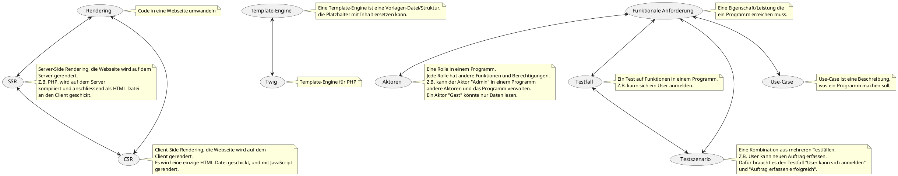
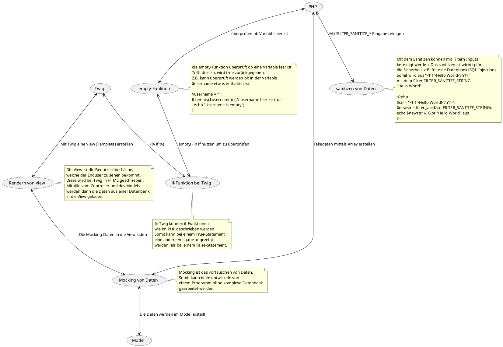
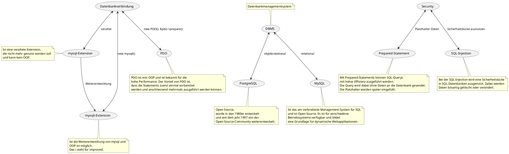

# LB2 Concept Map

```plantuml
@startuml

' ### Vorgegebene Begriffe ###
(SSR)
(CSR)
(Template-Engine) as (TE)
(Use-Case) as (UC)
(Aktoren)
(Funktionale Anforderung) as (FA)
(Testszenario) as (TS)
(Testfall) as (TF)

' ### Hilfsbegriffe ###
(Rendering)
(Twig)

' ### Map ###
(Rendering) <---> (SSR)
(Rendering) <---> (CSR)
(SSR) <---> (CSR)

(FA) <---> (TS)
(FA) <---> (TF)
(FA) <---> (UC)
(FA) <---> (Aktoren)
(TF) <---> (TS)

(TE) <---> (Twig)

' ### Notes ###
note right of (Rendering)
  Code in eine Webseite umwandeln
end note

note right of (SSR)
  Server-Side Rendering, die Webseite wird auf dem
  Server gerendert.
  Z.B. PHP, wird auf dem Server
  kompiliert und anschliessend als HTML-Datei
  an den Client geschickt.
end note

note right of (CSR)
  Client-Side Rendering, die Webseite wird auf dem
  Client gerendert.
  Es wird eine einzige HTML-Datei geschickt, und mit JavaScript
  gerendert.
end note

note right of (TE)
  Eine Template-Engine ist eine Vorlagen-Datei/Struktur,
  die Platzhalter mit Inhalt ersetzen kann.
end note

note right of (Twig)
  Template-Engine für PHP
end note

note right of (FA)
  Eine Eigenschaft/Leistung die
  ein Programm erreichen muss.
end note

note right of (Aktoren)
  Eine Rolle in einem Programm.
  Jede Rolle hat andere Funktionen und Berechtigungen.
  Z.B. kann der Aktor "Admin" in einem Programm
  andere Aktoren und das Programm verwalten.
  Ein Aktor "Gast" könnte nur Daten lesen.
end note

note right of (TF)
  Ein Test auf Funktionen in einem Programm.
  Z.B. kann sich ein User anmelden.
end note

note right of (TS)
  Eine Kombination aus mehreren Testfällen.
  Z.B. User kann neuen Auftrag erfassen.
  Dafür braucht es den Testfall "User kann sich anmelden"
  und "Auftrag erfassen erfolgreich".
end note

note right of (UC)
  Use-Case ist eine Beschreibung,
  was ein Programm machen soll.
end note

@enduml
```

```plantuml
@startuml

' ### Vorgegebene Begriffe ###
(if-Funktion bei Twig) as (if)
(Mocking von Daten) as (mock)
(Rendern von View) as (rendV)
(empty-Funktion) as (empFunc)
(sanitizen von Daten) as (san)

' ### Hilfsbegriffe ###
(Twig)
(PHP)
(Model)

' ### Map ###
(Twig) <---> (if) : {% if %}
(Twig) <---> (rendV) : Mit Twig eine View (Template) erstellen

(PHP) <---> (mock) : Fakedaten mittels Array erstellen
(PHP) <---> (empFunc) : überprüfen ob Variable leer ist
(PHP) <---> (san) : Mit FILTER_SANITIZE_* Eingabe reinigen

(rendV) <---> (mock) : Die Mocking-Daten in die View laden

(mock) <---> (Model) : Die Daten werden im Model erstellt

(empFunc) <---> (if) : empty() in if nutzen um zu überprüfen

' ### Notes ###
note bottom of (if)
  In Twig können if-Funktionen
  wie im PHP geschrieben werden.
  Somit kann bei einem True-Statement
  eine andere Ausgabe angezeigt
  werden, als bei einem False-Statement.
end note

note right of (mock)
  Mocking ist das vortäuschen von Daten.
  Somit kann beim entwickeln von
  einem Programm ohne komplexe Datenbank
  gearbeitet werden.
end note

note right of (rendV)
  Die View ist die Benutzeröberfläche,
  welche der Enduser zu sehen bekommt.
  Diese wird bei Twig in HTML geschrieben.
  Mithilfe vom Controller und des Models
  werden dann die Daten aus einer Datenbank
  in die View geladen.
end note

note right of (empFunc)
  die empty-Funktion überprüft ob eine Variable leer ist.
  Trifft dies zu, wird true zurückgegeben.
  Z.B. kann überprüft werden ob in der Variable
  $username etwas enthalten ist.
  
  $username = "";
  if (empty($username)) { // username leer => true
    echo "Username is empty";
  }
end note

note right of (san)
  Mit dem Sanitizen können mit Filtern Inputs
  bereinigt werden. Das sanitizen ist wichtig für
  die Sicherheit, z.B. für eine Datenbank (SQL-Injection).
  Somit wird aus "<h1>Hello World</h1>"
  mit dem Filter FILTER_SANITIZE_STRING
  "Hello World".
  
  <?php
  $str = "<h1>Hello World!</h1>";
  $newstr = filter_var($str, FILTER_SANITIZE_STRING);
  echo $newstr; // Gibt "Hello World" aus
  ?>
end note

@enduml
```

```plantuml
@startuml

' ### Vorgegebene Begriffe ###
(mysql-Extension) as (mysql-e)
(mysqli-Extension) as (mysqli-e)
(PDO)
(PostgreSQL)
(MySQL)
(Prepared-Statement) as (prepState)
(SQL-Injection) as (sql-inj)

' ### Hilfsbegriffe ###
(Datenbankverbindung) as (dbconn)
(DBMS)
(Security)

' ### Map ###
(dbconn) <---> (mysql-e) : veraltet
(dbconn) <---> (mysqli-e) : new mysqli()
(dbconn) <---> (PDO) : new PDO(), $pdo->prepare()

(mysql-e) ---> (mysqli-e) : Weiterentwicklung

(DBMS) <---> (PostgreSQL) : objektrelational
(DBMS) <---> (MySQL) : relational

(Security) <---> (prepState) : Platzhalter-Daten
(Security) <---> (sql-inj) : Sicherheitslücke ausnutzen

' ### Notes ###
note left of (mysql-e)
  Ist eine veraltete Extension,
  die nicht mehr genutzt werden soll
  und kann kein OOP.
end note

note bottom of (mysqli-e)
  Ist die Weiterentwicklung von mysql und
  OOP ist möglich.
  Das i steht für improved.
end note

note bottom of (PDO)
  PDO ist rein OOP und ist bekannt für die
  hohe Performance. Der Vorteil von PDO ist,
  dass die Statements zuerst einmal vorbereitet
  werden und anschliessend mehrmals ausgeführt werden können.
end note

note bottom of (PostgreSQL)
  Open Source,
  wurde in den 1980er entwickelt
  und seit dem Jahr 1997 von der
  Open-Source-Community weiterentwickelt.
end note

note bottom of (MySQL)
  Ist das am verbreiteste Management-System für SQL
  und ist Open-Source. Es ist für verschiedene
  Betriebssysteme verfügbar und bildet
  eine Grundlage für dynamische Webapplikationen.
end note

note bottom of (prepState)
  Mit Prepared-Statements können SQL-Querys
  mit hoher Effizienz ausgeführt werden.
  Die Query wird dabei ohne Daten an die Datenbank gesendet.
  Die Platzhalter werden später eingefüllt.
end note

note bottom of (sql-inj)
  Bei der SQL-Injection wird eine Sicherheitslücke
  in SQL-Datenbanken ausgenutzt. Dabei werden
  Daten bösartig gelöscht oder verändert.
end note

note top of (DBMS)
  Datenbankmanagementsystem
end note

@enduml
```