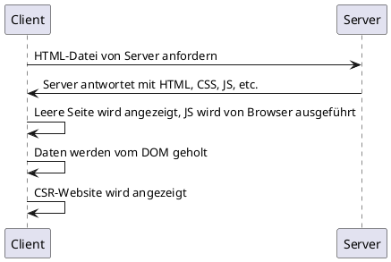

# PlantUML CSR

```plantuml
@startuml
Client -> Server: HTML-Datei von Server anfordern
Server -> Client: Server antwortet mit HTML, CSS, JS, etc.
Client -> Client: Leere Seite wird angezeigt, JS wird von Browser ausgeführt
Client -> Client: Daten werden vom DOM geholt
Client -> Client: CSR-Website wird angezeigt
@enduml
```