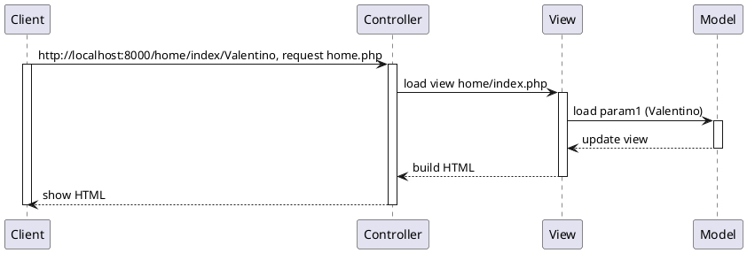
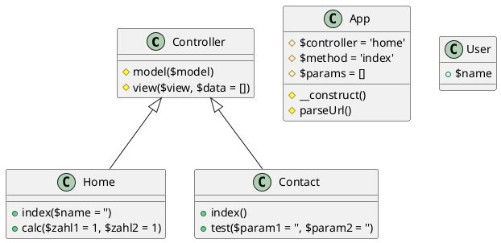

# PlantUML MVC

## Sequenzdiagramm

```plantuml
@startuml
Client -> Controller : http://localhost:8000/home/index/Valentino, request home.php
activate Client
activate Controller
Controller -> View : load view home/index.php
activate View
View -> Model : load param1 (Valentino)
activate Model
Model --> View : update view
deactivate Model
View --> Controller : build HTML
deactivate View
Controller --> Client : show HTML
deactivate Controller
deactivate Client
@enduml
```

## Klassendiagramm

```plantuml
@startuml
class Controller {
  # model($model)
  # view($view, $data = [])
}

class App {
  # $controller = 'home'
  # $method = 'index'
  # $params = []
  # __construct()
  # parseUrl()
}

class Home extends Controller {
  + index($name = '')
  + calc($zahl1 = 1, $zahl2 = 1)
}

class Contact extends Controller {
  + index()
  + test($param1 = '', $param2 = '')
}

class User {
  + $name
}
@enduml
```